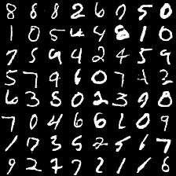
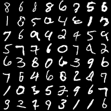
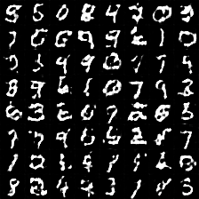
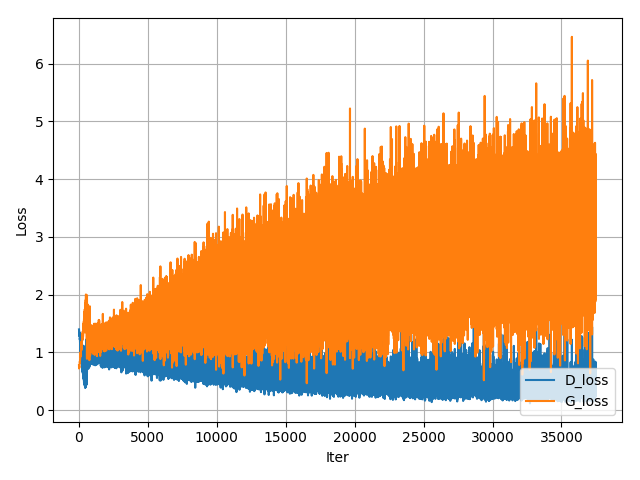

# pytorch-GANs
My items: [[Tensorflow version]](https://github.com/TwistedW/GANs)

# The original code address
https://github.com/hwalsuklee/tensorflow-generative-model-collections

## Project progress
It's adapted to the cifar10, celebA. Details can be reached via email.

#### Fixed generation
All results are generated from the fixed noise vector.


### Results for mnist

The following results can be reproduced with command:
```
python main.py --dataset mnist --gan_type <TYPE> --epoch 40 --batch_size 64
```

*Name* | *Epoch 1* | *Epoch 20* | *Epoch 40* | *GIF*
:---: | :---: | :---: | :---: | :---: |
GAN |  |
 |
 |


#### Loss plot
*Name* | *Loss*
:---: | :---: |
GAN | 

## Folder structure
The following shows basic folder structure.
```
├── main.py # gateway
├── data
│   ├── mnist # mnist data (not included in this repo)
│       ├── t10k-images-idx3-ubyte.gz
│       ├── t10k-labels-idx1-ubyte.gz
│       ├── train-images-idx3-ubyte.gz
│       └── train-labels-idx1-ubyte.gz
│
├── GAN.py # vainilla GAN
├── utils.py # utils
├── models # model files to be saved here
└── results # generation results to be saved here
```

## Development Environment
* Ubuntu 16.04 LTS
* NVIDIA GTX 1080
* cuda 8.0
* Python 3.5.2
* pytorch 0.2.0.post3
* torchvision 0.1.9

## Acknowledgements
This implementation has been based on
[tensorflow-generative-model-collections](https://github.com/hwalsuklee/tensorflow-generative-model-collections)
and tested with Pytorch on Ubuntu 16.04 using GPU.